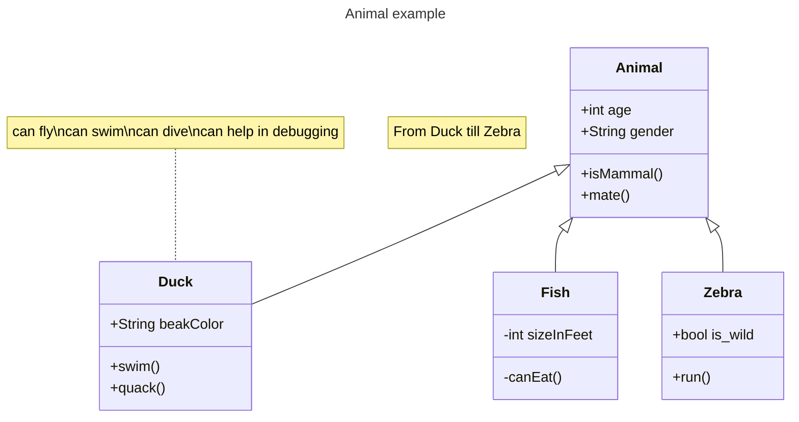

# Welcome!

This is a basic example of documentation. It is intended as a showcase of some of the
features that TechDocs provides out of the box.

You can see also:

- [A sub page](sub-page.md)
- [Inline code examples](code/code-sample.md)
- [Plugin & Extension examples](extensions.md) - Diagrams, emojis, visual formatting.

## Basic Markdown

Headings:

# h1

## h2

### h3

#### h4

##### h5

###### h6

Here is a bulleted list:

- Item one
- Item two
- Item Three

Check out the [Markdown Guide](https://www.markdownguide.org/) to learn more about how to
simply create documentation.

You can also learn more about how to configure and setup this documentation in Backstage,
[read up on the TechDocs Overview](https://backstage.io/docs/features/techdocs/).

## Image Example

This documentation is powered by Backstage's TechDocs feature:

## Table Example

While this documentation isn't comprehensive, in the future it should cover the following
topics outlined in this example table:

| Topic   | Description                                                  |
| ------- | ------------------------------------------------------------ |
| Topic 1 | An introductory topic to help you learn about the component. |
| Topic 2 | A more detailed topic that explains more information.        |
| Topic 3 | A final topic that provides conclusions and lessons learned. |

## mermaid sample

